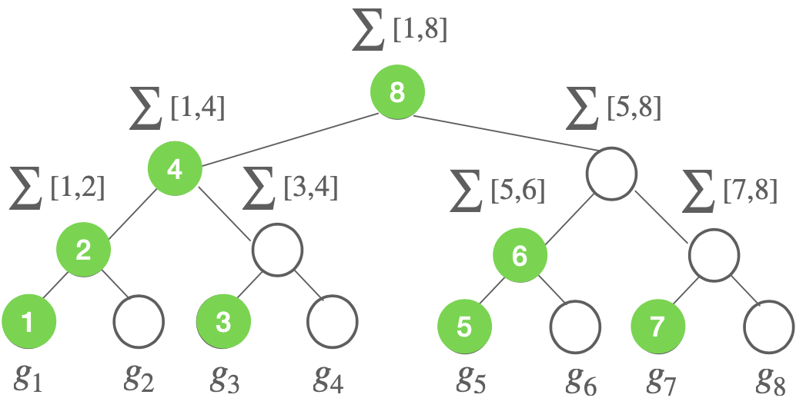

In this series of blog posts, I plan to write down some of my personal understanding (of course shaped by many wonderful papers) of DP-FTRL and matrix matrix factorization mechanism.

Building upon the classic online learning algorithm FTRL, DP-FTRL [[KMSTTX21]](https://arxiv.org/pdf/2103.00039.pdf) is the private version, proposed to get rid of subsampling and shuffling in DP-SGD while achieving similar or better privacy-utility trade-off. DP-FTRL has been used in production by Google for private ML training, see [[XZACKMRZ23]](https://arxiv.org/pdf/2305.18465.pdf). The key idea is simple -- the regret/utility analysis in standard FTRL only relies on the prefix sum of gradients and hence it suffices to privatize each prefix sum for privacy. Not surprisingly, this idea has been explored before in private online learning, e.g., [[JKT12]](https://arxiv.org/abs/1109.0105), [[GS13]](https://proceedings.neurips.cc/paper_files/paper/2013/file/c850371fda6892fbfd1c5a5b457e5777-Paper.pdf), [[AS17]](https://arxiv.org/pdf/1701.07953.pdf). One popular way to privatize prefix sum is the so-called tree-based algorithm [[CSS11]](https://eprint.iacr.org/2010/076.pdf), [[DNPR10]](https://www.wisdom.weizmann.ac.il/~naor/PAPERS/continual_observation.pdf) and its variance improved version by Honaker [[Hon15]](https://tpdp.journalprivacyconfidentiality.org/2015/abstracts/TPDP_2015_1.pdf). In particular, given a stream of gradients $$g_1, g_2,\ldots, g_T \in \mathbb{R}^d$$ with bounded $$\ell_2$$ norm, instead of adding noise to each gradient (i.e., Simple II mechanism in [[CSS11]](https://eprint.iacr.org/2010/076.pdf)) or to each prefix sum (i.e., Simple I mechanism in [[CSS11]](https://eprint.iacr.org/2010/076.pdf)), the tree-based algorithm adds noise to each partial sum, see [Fig. 1.1](#tree) below for an illustration. As we will see later, these three different ways of adding noise correspond to different factorization methods. The key benefit of adding noise to partial-sum nodes is a good balance between sensitivity and total number of added noise.

    

<em>Fig 1.1:</em> Illustration of tree-based algorithm. It adds noise to each non-private tree node (which is a partial sum $$\sum[i,j] := \sum_{s=i}^j g_s$$). The amount of noise at each node for privacy is determined by the total sensitivity of the tree, which is $$\sqrt{O(\log T)}$$ under $$\ell_2$$ norm.  Each noisy prefix sum at time $$t$$ can be computed by at most $$O(\log t)$$ noisy tree nodes. Thus, the total additional noise variance is $$O_{\delta}(\log t \cdot \log T\cdot 1/\epsilon^2)$$ for $$(\epsilon,\delta)$$-DP. Ignoring all log terms, we have the total noise in noisy prefix sum is $$\tilde{O}_{\delta}(1/\epsilon^2)$$ for each coordinate $$i\in [d]$$. Note that, for the online update, one only needs to compute the noisy tree nodes indicated by green color (see [my slides](https://xingyuzhou.org/talks/FLCB-OSU.pdf) (page 29) for details).

DP-FTRL essentially leverages the idea of tree-based algorithm to achieve a similar or better privacy-utility trade-off than DP-SGD, without requiring the use of privacy amplification by subsampling or shuffling. One utility metric considered in [[KMSTTX21]](https://arxiv.org/abs/1405.7085) is online (average) regret defined below.

$$
\mathcal{R}(T) = \frac{1}{T} \cdot \left(\sum_{t}^T f_t(x_t) - f_t(x^*)\right), \tag{1.1}
$$
where $$f_t(x) = \ell (x; \xi_t)$$ and $$\ell(x;\xi_t)$$ is the loss of model parameter $$x$$ under sample $$\xi_t$$ and a fixed (convex) loss function $$\ell$$. Here, $$x^*$$ is any reference parameter.  As in standard online learning, $$f_t$$ can be adversarially chosen (hence $$\xi_t$$ can be arbitrarily chosen without a distribution assumption).

Let us summarize the key utility (regret) result in [[KMSTTX21]](https://arxiv.org/pdf/2103.00039.pdf) (cf. Theorem C.1) under $$(\epsilon,\delta)$$-DP. At a high level, one can represent the high-probability regret in [(1.1)](#eq1) under DP-FTRL as follows (assume Lipschitz constant of $$f_t$$ is $$L=1$$, $$x_1 = 0$$ and $$\lVert x \rVert_2 \leq D^2$$).  

$$
 \mathcal{R}_{\text{DP-FTRL}}(T) \le O\left( \frac{1+ \text{maximal error in prefix sum}}{\lambda} + \frac{\lambda D^2}{T}\right), \tag{1.2}
$$
where $$\lambda$$ is the coefficient of the regularizer in FTRL (which is related to the inverse of the learning rate in OMD or SGD). For non-private case (where the error term is zero), choosing $$\lambda = {\sqrt{T}}/{D}$$, yields the standard non-private (average) regret of $$D/\sqrt{T}$$. For the DP case, it only needs to compute the error in prefix sum. Let $$n_t \in \mathbb{R}^d$$ be the difference between the noisy prefix sum at time $$t$$ and the non-private true prefix sum at time $$t$$. The maximal error in prefix sum is given by $$\max_{t\in T} \lVert n_t \rVert_2$$. Then, as explained in [Fig. 1.1](#tree), $$\lVert n_t \rVert_2 \approx \sqrt{d} \cdot 1/\epsilon$$, for all $$t \in [T]$$ with high probability. Plugging in $$\sqrt{d} \cdot 1/\epsilon$$ as the maximal error into [(1.2)](#eq2) and choosing $$\lambda = \max\left\{\frac{\sqrt{T}}{D}, \frac{d^{1/4}\sqrt{T/\epsilon}}{D}\right\}$$ , one can obtain the final high-probability regret of DP-FTRL with tree-based algorithm for prefix sum as

$$
  \mathcal{R}_{\text{DP-FTRL}}(T) \le O\left( D\cdot \left(\frac{1}{\sqrt{T}} + \frac{d^{1/4}}{\sqrt{T \epsilon}}\right)\right). \tag{1.3}
$$

*Remark 1.1:* From the online regret guarantee, one can follow the standard online-to-batch approach to obtain the bound on population excess risk when $$\xi_t$$ is sampled from a fixed distribution. The high-probability regret bound (i.e., Theorem C.1 in [[KMSTTX21]](https://arxiv.org/pdf/2103.00039.pdf)) leads to high-probability population excess risk bound while an expected regret bound leads to an expected excess risk bound. For this reason, some work only plugs in expected error in prefix sum for only expected population excess risk bound.

*Remark 1.2:*   As shown in [[KMSTTX21]](https://arxiv.org/pdf/2103.00039.pdf), the total added noise in DP-FTRL is similar to the one in DP-SGD with amplification. For a quick high-level intuition, consider the case $$T = n$$ ($$n$$ is the number of samples) for both DP-FTRL and DP-SGD with amplification (either by subsampling or shuffling). The total amount of noise for DP-FTRL is $$\tilde{O}_{\delta}(1/\epsilon^2)$$ for each coordinate $$i\in [d]$$ as already mentioned above. For a constant learning rate of SGD, the final iterate is simply the sum of true gradients plus $$T=n$$ added noise. Due to amplification, for $$(\epsilon,\delta)$$-DP, the variance of each step's noise only needs to be $$\tilde{O}_{\delta}(1/(\epsilon^2 n))$$ (due to the standard $$1/\sqrt{n}$$ amplification). As a result, the total noise in DP-SGD is $$n\cdot \tilde{O}_{\delta}(1/(\epsilon^2 n))$$, which is the same as the one in DP-FTRL.

### A peek into follow-up posts...

At this moment, we may naturally ask the following questions:

**Q1.** Can we find even better methods (in terms of the maximal error) than the tree-based algorithm for private prefix sum?

**Q2.** Is minimizing the maximal error in prefix sum the right metric for utility performance?

Q1 above will lead us to the main topic for the next post in this series -- matrix factorization mechanism. Q2 will motivate us to question the tightness of the bound in [(1.2)](#eq2), which will be discussed later.

**THE END**
{: .center}

Now, it's time to take a break by appreciating the masterpiece of Monet.

{: .center}
{:height="400px" width="500px"}

**Water Lilies, Evening Effect**
{: .center}
_courtesy of https://www.wikiart.org/_
{: .center}
