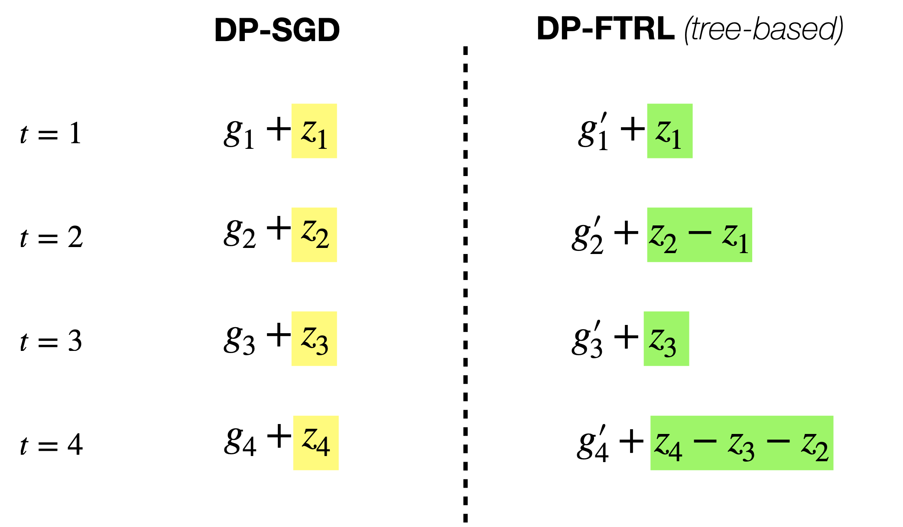

$$
\newcommand{\bA}{\mathbf{A}}
\newcommand{\bB}{\mathbf{B}}
\newcommand{\bC}{\mathbf{C}}
\newcommand{\cA}{\mathcal{A}}
\newcommand{\cR}{\mathcal{R}}

\newcommand{\bH}{\mathbf{H}}
\newcommand{\bI}{\mathbf{I}}
\newcommand{\bG}{\mathbf{G}}
\newcommand{\bZ}{\mathbf{Z}}
\newcommand{\Real}{\mathbb{R}}
\newcommand{\cN}{\mathcal{N}}
\newcommand{\norm}[1]{\left\lVert#1\right\rVert}
\newcommand{\ex}[1]{\mathbb{E}\left[ #1 \right] }
\newcommand{\cL}{\mathcal{L}}
$$

In this series of blog posts, I plan to write down some of my personal understanding (of course shaped by many wonderful papers) of DP-FTRL and matrix factorization mechanism.

As motivated at the end of the [previous post](https://xingyuzhou.org/blog/notes/DP-FTRL-and-matrix-factorization-(III)), in this post, we aim to study whether minimizing the error in prefix sum is sufficient for a tight performance guarantee. To this end, we first relate DP-FTRL with DP-SGD, from which we will see that the FTRL-style analysis (along with its regret, i.e., [(1.2)](https://xingyuzhou.org/blog/notes/DP-FTRL-and-matrix-factorization-(I)#eq2) is not tight in the DP case. Instead, as first observed in [[KMCRM23]](https://arxiv.org/abs/2302.01463), we might need to carefully analyze the *per-step* behavior rather than only focusing on the noisy prefix sum (this might remind you about the standard FTRL vs. OMD (OGD) style analysis in online learning). In the following, let us first use a simple example to show that the prefix-sum view and its analysis in [(I)](https://xingyuzhou.org/blog/notes/DP-FTRL-and-matrix-factorization-(I)) is not tight, which in turn questions the optimization objective in the matrix factorization of [(III)](https://xingyuzhou.org/blog/notes/DP-FTRL-and-matrix-factorization-(III)).

**Example 4.1 (One-pass DP-SGD without Amplification)** Under this algorithm denoted by $$\cA$$, one Gaussian noise $$z_t$$ is added to each step's gradient, which is computed on the $$t$$-th data sample.  For this algorithm, we will show that FTRL-style analysis as in [(I)](https://xingyuzhou.org/blog/notes/DP-FTRL-and-matrix-factorization-(I)) only gives a loose bound while per-step OGD-style analysis gives a tighter bound. First, under FTRL-style analysis, $$\cA$$ just replaces tree-based algorithm in DP-FTRL with Simple II (cf. Example 2.2 in [(II)](https://xingyuzhou.org/blog/notes/DP-FTRL-and-matrix-factorization-(II))). Thus, by Example 2.2, we have the maximal error in [(1.2)](https://xingyuzhou.org/blog/notes/DP-FTRL-and-matrix-factorization-(I)#eq2) is on the order of $$\sqrt{T}/\epsilon$$ (ignoring $$d$$). Choosing $$\lambda$$ optimally gives the privacy cost of $$O(1/T^{1/4})$$ in regret. On the other hand, by a simple adaptation of standard OGD (adding additional noise $$O(1/\epsilon^2)$$ to each gradient), the privacy cost is only $$O(1/(\epsilon \sqrt{T}))$$ in regret.

Therefore, one question to ask is -- can we formulate DP-FTRL with different mechanisms in a similar style to DP-SGD? Then, one can try to adapt the standard OGD-style (per-step) analysis to have a tighter bound. This is exactly the main motivation of the recent nice NeurIPS paper [[KMCRM23]](https://arxiv.org/abs/2302.01463). In the following, let us first look at another view of DP-FTRL (with tree-based algorithm), as illustrated in the figure below.

    

<em>Fig 4.1:</em> DP-SGD vs. DP-FTRL. We compare the per-step information in each iteration step $$t$$. For DP-SGD, the non-private gradient $$g_t$$ is perturbed by *independent* noise $$z_t$$. On the other hand, for DP-FTRL, the non-private gradient $$g_t'$$ is perturbed by *negatively correlated* noise. One thing to note is that the non-private gradients are not the same ($$g_t$$ vs. $$g_t'$$) even if it is computed on the same sample for each $$t$$, due to the different model updates under DP-SGD and DP-FTRL.

In [[KMCRM23]](https://arxiv.org/abs/2302.01463), the authors write all MF-DP-FTRL (i.e., DP-FTRL with general matrix factorization) as a similar update in [Fig. 4.1](#correlated). In particular, with $$\bA = \bB \bC$$, the per-step new information is given by $$(\bB_{[t+1,:]} - \bB_{[t,:]}) \bZ$$ (check it using [Fig. 4.1](#correlated) and [(2.1)](https://xingyuzhou.org/blog/notes/DP-FTRL-and-matrix-factorization-(II)#eq21). Hence, the iterate update is given by
$$
    x_{t+1} = x_t -\eta \cdot \left(g_t + (\bB_{[t+1,:]} - \bB_{[t,:]}) \bZ \right).
$$
Based on this, one key contribution of [[KMCRM23]](https://arxiv.org/abs/2302.01463) is to directly analyze its convergence, which is tighter than the prefix-sum view results in the previous two sections. Moreover, with its new analysis, it recovers the $$O(1/\sqrt{T})$$ for the algorithm in Example 4.1 above (cf. Theorem 4.7 in [[KMCRM23]](https://arxiv.org/abs/2302.01463)).

Let us end this section with another simple algorithm that can achieve $$O(1/\sqrt{T\epsilon})$$ regret as DP-FTRL with tree-based algorithm for $$\epsilon \le 1$$\footnote{In fact, this new algorithm is even better in terms of log terms}.

**Example 4.1 (Batch OGD)** Under this algorithm, it only updates the model every $$B$$ iterations. For each batch $$m \in [T/B]$$, it computes the gradient using the most recent model parameter, takes the average of the new batch of gradients, and adds noise for privacy. This is essentially running the algorithm in Example 4.1 above with only $$M:= T/B$$ steps and the noise for each step is $$1/B$$ factor smaller due to averaging. Thus, the total regret under $$(\epsilon,\delta)$$-DP can be written as

   $$
       \cR_{\text{batch-OGD}}(T) \le O_{\delta}\left(B \cdot \left(\frac{1}{\sqrt{M}} + \frac{1}{B \epsilon  \sqrt{M}}\right)\right).
   $$

   Optimizing the choice of $$B = 1/\epsilon$$, yields regret as $$O_{\delta}\left(\frac{1}{\epsilon \sqrt{T}}\right)$$.

[^1]: One subtlety here is that gradients in $$\bG$$ in model training is adaptive rather than fixed. However, as shown in [[DMRSG22]](https://arxiv.org/pdf/2202.08312.pdf), for the Gaussian mechanism, it suffices to consider the non-adaptive one.

**THE END**
{: .center}

Now, it's time to take a break by appreciating the masterpiece of Monet.

{: .center}
{:height="400px" width="500px"}

**Water Lilies**
{: .center}
_courtesy of https://www.wikiart.org/_
{: .center}
